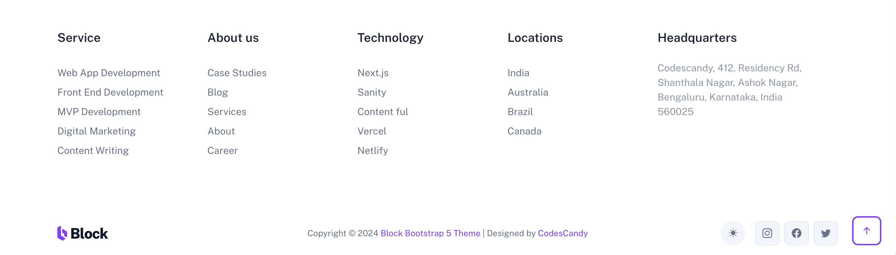

# Code Together

**Footer**

Créer un footer à partir du modèle suivant :

## Règles de collaboration

Vous devez absolument travailler sur une branche distincte de la branche principale (`main`). Pour cela, vous devez créer une branche à partir de la branche principale (`main`) et lui donner un nom explicite en rapport avec la partie que vous allez coder.

Seul le chef de projet peut fusionner les branches dans la branche principale (`main`).

Pour demaander une fusion (`merge`), vous devez soumettre une `pull request` en expliquant ce que vous avez fait et pourquoi vous avez fait ces modifications.